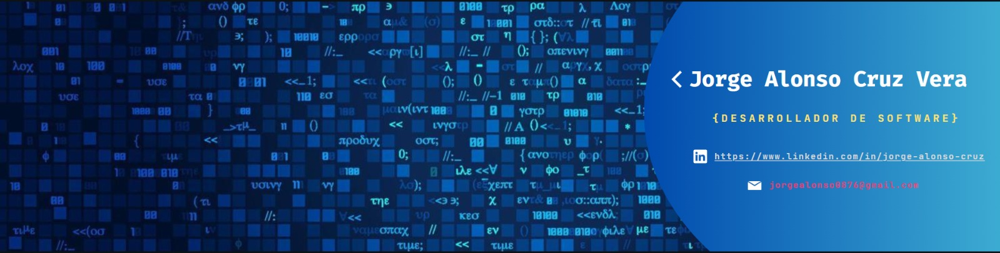

<h2 align="center">Heyo!👋 I'm Alonso 🤠</h2>
<h3 align="center">Welcome to my show 🫡</h3>  
  

    
  

   
<li style="display:flex;"> 

<b>About Me?</b>

</li>

  

  - 🫣 My name is Alonso! Welcome to my Github Profile  
  - 🌱 I’m currently learning Backend-Development 
  - 💬 Ask me about Java, Javascript or Typescript 🧐 
  - 🍅 I hate the bugs 🪲 but I love the solves 😋 
  - ⚡ You only fail if you give up 💪  
  

  

    
  

